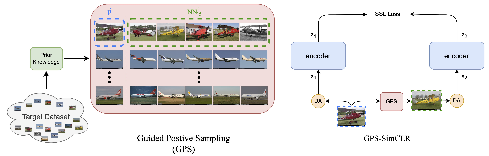
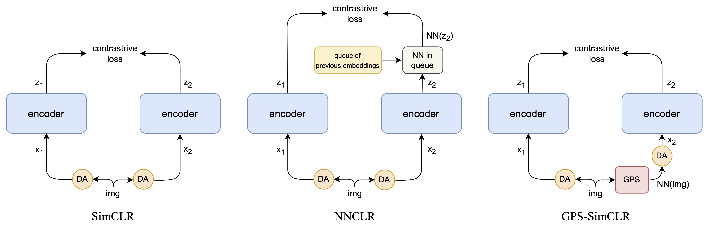

# GPS: Guided Positive Sampling To Move Away From Data-Augmentation In SSL
Repository for the "GPS: Guided Positive Sampling To Move Away From Data-Augmentation In SSL" Paper. [download paper](paper.pdf)

## General framework of GPS-SSL:




## Comparison with other baseline SSL methods:




Link to download RHID (Revised HotelID-2021) will soon be provided.


Example of running the code:
```
python main_nn.py --config-path=scripts/pretrain_gps/aircrafts/ --config-name=simclr.yaml augmentations=reconstruction backbone.name=resnet18 data.num_nns=1 data.num_nns_choice=5 data.reload_freq=0 emb_model=resnet50 max_epochs=200 nn_key=feats optimizer.classifier_lr=0.3 optimizer.lr=0.1 optimizer.weight_decay=0.001
```
